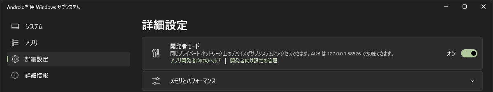
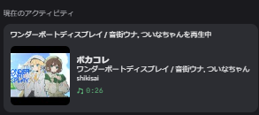

# WSA RPC Bridge

[English](README_en.md) | [日本語](README.md)

WSA (Windows Subsystem for Android) 上で動作しているアプリケーションのメディア再生情報を ADB 経由で取得し、Discord Rich Presence に表示するデスクトップアプリ。

## 注意

WSA側で、開発者モードを有効にしている必要があります。



## 機能

- WSA 上のアプリの再生情報（曲タイトル、アーティスト、アルバム、再生位置）を自動取得
- Discord Rich Presence に再生状況を表示
- アプリ名・アプリアイコンの自動解決
- トレイ常駐（タスクトレイに格納可能）
- マルチ言語対応（日本語 / English）

## スクリーンショット




## 技術スタック

- **フロントエンド**: SolidJS + Kobalte + Vite
- **バックエンド**: Rust / Tauri v2

## ビルド

```bash
pnpm install
pnpm tauri build
```

## 開発

```bash
pnpm dev       # Vite dev server
pnpm tauri dev # Tauri + Vite dev
pnpm lint      # oxlint
```

## テスト

```bash
cd src-tauri
cargo test                          # ユニットテスト（パーサーなど）
cargo test -- --ignored             # WSA 実機が必要な結合テスト
```

## インストール

[Releases](https://github.com/hu-ja-ja/WSA_RPC_Bridge/releases) から最新のインストーラをダウンロードして実行してください。

## 謝辞

### アイデア

- [Kizzy](https://github.com/dead8309/Kizzy)

### 主要Crates

- [adb_client](https://github.com/cocool97/adb_client)
- [discord-rich-presence](https://github.com/vionya/discord-rich-presence)
- [apk-info](https://github.com/delvinru/apk-info)

## ライセンス

MPL-2.0 License
