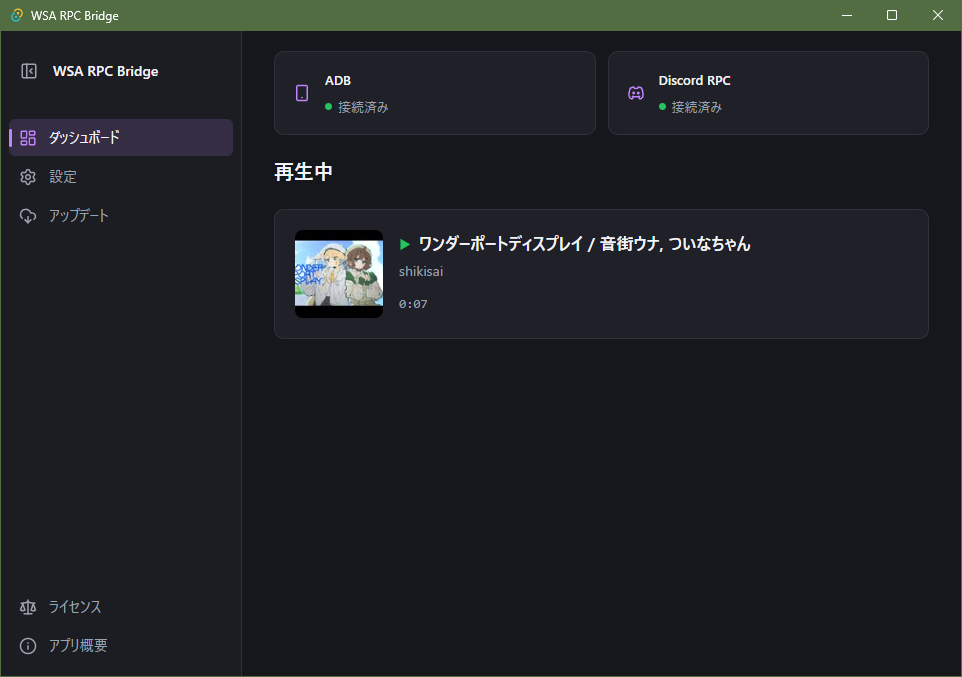

# WSA RPC Bridge

[English](README_en.md) | [日本語](README.md) | [ドキュメント](https://hu-ja-ja.github.io/WSA_RPC_Bridge/docs/)

WSA (Windows Subsystem for Android) や Android デバイスで再生されているメディア情報を取得し、Discord Rich Presence に表示するアプリ (Windows デスクトップ / Android 対応) 。ユーザー向けの導入・機能・法務情報は [ドキュメントサイト](https://hu-ja-ja.github.io/WSA_RPC_Bridge/docs/) を参照してください。

## スクリーンショット




## 技術スタック

| レイヤー           | 技術                                  |
|--------------------|---------------------------------------|
| フロントエンド     | SolidJS + [Kobalte](https://kobalte.dev/) + Vite |
| バックエンド       | Rust / Tauri v2                       |
| Android ネイティブ | Kotlin (通知アクセス / JNI ブリッジ)  |
| ドキュメント       | Astro Starlight (site/)               |

## リポジトリ構成

```
src/                  SolidJS フロントエンド (Vite SPA)
src-tauri/            Rust / Tauri 本体 + Android (gen/android)
docs/                 ※ 旧 Markdown ドキュメント。現在は site/ に移行
site/                 ドキュメントサイト (Astro Starlight)。GitHub Pages の /docs/ にデプロイ
scripts/              ビルド支援スクリプト (ライセンス生成など)
.github/workflows/     CI / リリース / ドキュメントの自動化
```

## 開発

ツールは [mise](https://mise.jdx.dev/) で管理しています。コマンドは mise のタスクとして定義され、`mise run <task> -- <args>` で引数を渡せます。

```pwsh
mise trust        # 初回のみ
mise install      # Node / pnpm / Rust / Perl / Java を導入
mise run deps     # JS 依存をインストール
mise run dev      # Tauri + Vite dev
mise run build    # リリースビルド
mise run lint     # oxlint
mise run test     # Rust ユニットテスト
mise run android-test  # Android ユニットテスト (Robolectric)
mise run generate-licenses  # サードパーティライセンスの再生成
```

`dev` / `build` / `tauri` タスクは [Infisical](https://infisical.com/) の `infisical run` を経由します (リリース署名用の秘密鍵の管理)。未ログイン時は `pnpm tauri ...` を直接実行してください。全コマンドの詳細は [コマンドリファレンス](https://hu-ja-ja.github.io/WSA_RPC_Bridge/docs/dev/commands) を参照。

## CI

- **ci.yml** — main への push / PR で lint / build / test / android-test を実行
- **release.yml** — `workflow_dispatch` から手動リリース。APK (aarch64) + MSI をビルドし、`update.json` を Pages ルートへデプロイ。詳細は [リリース方針](https://hu-ja-ja.github.io/WSA_RPC_Bridge/docs/dev/release)
- **docs.yml** — site/ の変更でドキュメントサイトを Pages の `/docs/` へデプロイ

## ドキュメントサイト (site/)

ドキュメントは `site/` の [Astro Starlight](https://starlight.astro.build/) プロジェクトで管理しています。日本語と英語で提供しています (英語は `/en/` 配下)。

```pwsh
mise run docs-dev      # ローカル dev server (http://localhost:4321)
mise run docs-build    # Pages デプロイ用ビルド (BASE_PATH=/WSA_RPC_Bridge/docs/)
```

ビルドは `BASE_PATH='/WSA_RPC_Bridge/docs/' pnpm --dir site build` で行い、`site/dist/` に出力されます。GitHub Pages のサブパス配信には Astro の `base` 設定を使用しています。

## ライセンス

Copyright (C) 2026 hu-ja-ja

[MPL-2.0](LICENSE)

サードパーティライセンスはアプリ内のライセンスタブから確認できます。
